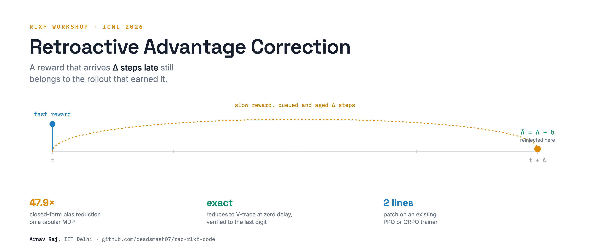

# Retroactive Advantage Correction (RAC)



Code for **"Retroactive Advantage Correction: Closed-Form V-Trace Bias
Correction for Delay-Aware RLHF"**, accepted at the **ICML 2026 Workshop on
Reinforcement Learning from World Feedback (RLxF)**.

Production RLHF reward signals are often slow: code-execution verifiers, judge
ensembles, and human review return several gradient steps after the rollout
that produced them. RAC queues each late reward, ages it through a non-negative
kernel, and reinjects it as a clipped residual onto the next optimiser step's
advantage. It is closed-form, needs no reward-model retraining, and drops into
PPO or GRPO as a two-line reward-manager patch.

## Repository layout

```
src/rac/        core primitive — correction δ, FIFO delay queue, age kernel,
                clipped IS ratio, multi-channel delay kernel Λ[k,Δ]
src/trainer/    multi_channel_reward_manager.py — the PPO/GRPO patch
scripts/        one reproduction script per paper claim (table below)
figures/        regenerates every paper figure from the JSON results
tests/          unit + integration tests
```

## Installation

```bash
pip install -r requirements.txt
```

Python 3.10+. The tabular benchmarks run on a single CPU thread in NumPy; the
7B probes use 4-bit inference for two reward heads on one H100.

## Experimental setup at a glance

| | Tabular MDP benchmark | 7B/8B reward-distribution probe |
|---|---|---|
| **Purpose** | closed-form policy bias vs. a known optimum | check RAC's algebra on real reward signals |
| **Delay Δ** | optimizer steps: {1,…,5} (headline), {5,20,50}, up to {100,200} | per-step samples — deterministic Δ=5, lognormal, Pareto |
| **Rollout** | 3-state × 2-action MDP, 1000 trials/seed | N=500 UltraFeedback prompts, ≤128 tokens, no PPO loop |
| **Rewards** | synthetic: fast = truth + 𝒩(0, σ_f²); slow = truth, delayed | fast = Qwen2.5-7B head; slow oracle = Skywork-8B; policy = Llama-3-8B |
| **Δ simulation** | FIFO buffer: a score from step *t* is released at *t+Δ* | sample a delay per step, forward-inject the residual at *t+Δ* |

Δ is measured in **optimizer (gradient) steps**, not wall-clock; the age kernel
is `w_age(Δ) = exp(−Δ/τ_age)`. The 7B probe is a static algebraic check
(identity actor `ρ=1`), not a training-speedup claim — end-to-end LLM PPO is
future work.

## Reproducing the paper

Each script writes to `results/` in the working directory.

| Claim | Command |
|---|---|
| Table 1 — K-sweep, 47.9× at K=2 | `python scripts/ablate_rac_components_K2_47_9.py` |
| Table 1 — baseline comparison | `python scripts/ablate_rac_components_K2_47_9.py --baselines` |
| App C — cross-topology K-sweep | `python scripts/run_K_sweep_parallel_resume.py && python scripts/aggregate_K_sweep.py` |
| App D — heavy-tailed delays | `python scripts/verify_rac_heavy_tail_delay.py` |
| App G — MDP-size scaling | `python scripts/adv_mdp_scaling.py` |
| App B — linear-slack at 7B | `python scripts/rac_lambda_slack_sweep.py` |
| App G — V-trace identity collapse (7B) | `python scripts/rac_vtrace_identity_kernel_check.py` |
| App G — advantage-quality probe (7B) | `python scripts/adv_quality_7B.py` |
| Figures | `python figures/<name>.py` |

```bash
pytest tests/    # unit + integration tests, incl. the KL* = 1.6259 crossover
```

## Citation

```bibtex
@inproceedings{raj2026rac,
  title     = {Retroactive Advantage Correction: Closed-Form {V-Trace}
               Bias Correction for Delay-Aware {RLHF}},
  author    = {Raj, Arnav},
  booktitle = {ICML 2026 Workshop on Reinforcement Learning from
               World Feedback (RLxF)},
  year      = {2026}
}
```

## License

CC BY 4.0. See `LICENSE`.
